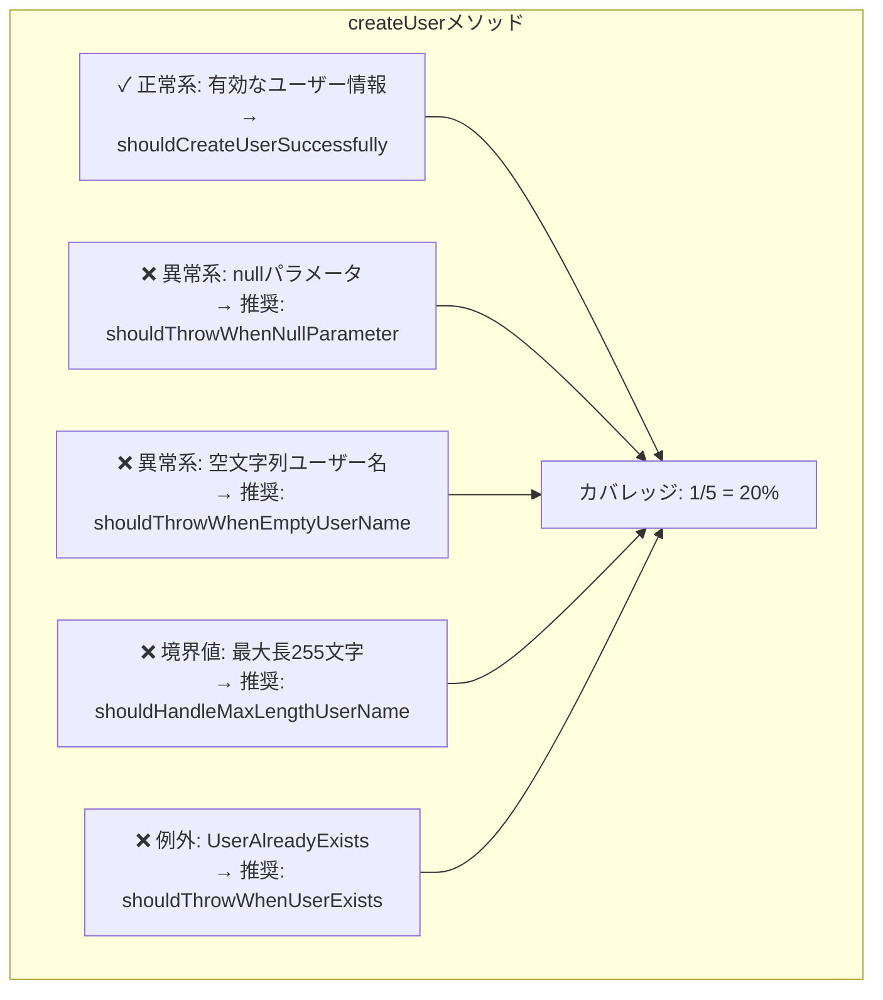
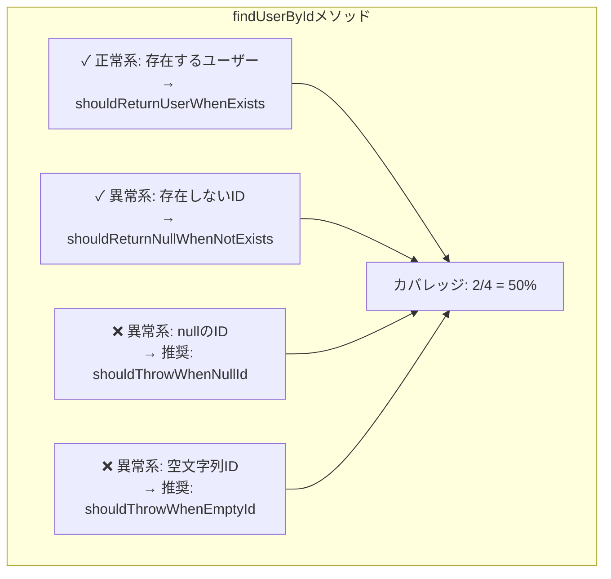

指定されたテストクラスを分析し、テストカバレッジの網羅性をレビューします。

YOU MUST: **TODOリストを作成して進めてください**

## 概要
指定されたテストクラスを分析し、テストカバレッジの網羅性をレビューします。  
t_wadaメソッドに基づいてテストの品質を評価し、実装済みテストケースと未実装領域を可視化したMermaid図を生成して、具体的な改善提案を行います。

TDDの第一人者であるt_wada氏の哲学に基づいた「t_wadaメソッド」により、テストコードをレビューし、改善提案を行います。

### 主要機能
- **カバーすべきテスト項目の明確化**: テスト対象の責務から必須テスト項目を自動導出
- **詳細なカバー状況の可視化**: 全体/カテゴリ別/優先度別のカバレッジ率を算出
- **未実装テストの優先度付け**: ビジネスクリティカルな観点から改善提案を生成

## 使用方法
```
/test-review <TestFilePath> [-u|-i]
```

### オプション
- `-u` または省略: ユニットテスト観点でレビュー（デフォルト）
- `-i`: 統合テスト観点でレビュー

### 使用例
```bash
# 単体テスト観点でのレビュー（デフォルト）
/test-review /path/to/UserService.test.ts

# 単体テスト観点でのレビュー（明示的指定）
/test-review /path/to/UserService.unit.test.ts -u

# 統合テスト観点でのレビュー
/test-review /path/to/UserRegistration.integration.test.ts -i
```

### 観点別の分析内容

#### 単体テスト観点 (unit)
- **焦点**: 個々のメソッド・関数の振る舞いと境界値
- **評価基準**:
  - 各メソッドの全分岐網羅
  - 境界値・異常値のテスト
  - 依存関係の適切なモック化
  - エラーハンドリングの網羅性
- **推奨テストケース**:
  - null/空値のハンドリング
  - 境界値（最小値、最大値、境界±1）
  - 例外ケース
  - 各条件分岐のテスト

#### シナリオテスト観点 (scenario)
- **焦点**: ユーザーストーリーやビジネスフローの実現
- **評価基準**:
  - エンドツーエンドのユースケース網羅
  - ビジネスルールの検証
  - 実際の利用シナリオの再現性
  - 複数機能の連携動作
- **推奨テストケース**:
  - ハッピーパス（正常系の一連の流れ）
  - 代替フロー（条件分岐を含むシナリオ）
  - エラーリカバリーシナリオ
  - 実際のユーザー操作を模したフロー

## 実行内容
1. テストクラスの読み込みと詳細解析
2. テストメソッドごとの具体的なシナリオ抽出
3. テストカバレッジの計算と未実装領域の特定
4. カテゴリ別に分割された複数のMermaid図生成
5. テストカバレッジ統計とサマリーの作成
6. 優先度別改善提案の生成
7. t_wada氏の視点でのテストレビューと改善提案

## プロンプト
まず、コマンドライン引数を解析してください：
- テストクラスパス: 第1引数
- 観点オプション: 
  - `-u` または オプションなし → 単体テスト観点（unit）
  - `-i` → 統合テスト観点（integration）

選択された観点（単体テスト or 統合テスト）に基づいて、指定されたテストクラスをレビューし、テストカバレッジの網羅性を評価してMermaid形式の可視化図を生成してください。

### t_wadaメソッドによる分析

YOU MUST: まず、 @~/.claude/workflow/testing.md のテストガイドラインを参照し、プロジェクトのテスト基準を把握してください。

その上で、選択された観点に応じて、以下のようにt_wada氏の思考パターンとTDDの哲学を適用してテストコードをレビューしてください：

**観点別のレビュー重点：**

【単体テスト観点の場合】
- メソッド単位での完全性を重視
- モックの適切な使用と依存性の分離を評価
- 境界値テストの網羅性を詳細にチェック
- 各分岐条件のテストカバレッジを厳密に評価

【統合テスト観点の場合】
- ビジネス価値の実現度を重視
- ユーザーストーリーの再現性を評価
- 複数コンポーネントの統合動作を確認
- 実際の利用フローとの一致度をチェック

**t_wada氏の視点でのレビュー基準：**

1. **テストの意図の明確性**
   - テスト名は「何をテストしているか」が一目で分かるか
   - テストが失敗した時、何が問題かすぐに理解できるか
   - Arrange-Act-Assertパターンが明確に分離されているか

2. **テストファーストの原則**
   - テストが実装の設計を導いているか
   - テストが仕様書として機能しているか
   - 過度に実装に依存していないか

3. **テストの保守性**
   - DRYではなくDAMP（Descriptive And Meaningful Phrases）を優先しているか
   - テストの重複は明示性のために許容されているか
   - セットアップが複雑すぎないか

4. **テストの信頼性**
   - テストは決定的（非決定的要素がない）か
   - 外部依存を適切にモック/スタブ化しているか
   - テストの実行順序に依存していないか

5. **TDDのリズム**
   - Red-Green-Refactorのサイクルが感じられるか
   - 最小限のテストから始めて段階的に複雑にしているか
   - 三角測量（Triangulation）が適切に使われているか

**t_wada氏スタイルのレビューコメント例：**
- 「このテストは『何を』ではなく『どのように』をテストしています。仕様に焦点を当てましょう」
- 「テスト名を日本語で書くことで、ビジネス要求との対応が明確になります」
- 「このセットアップは複雑すぎます。Object Motherパターンの導入を検討してください」
- 「境界値テストが不足しています。0、1、多数のケースを必ず含めましょう」

**評価の5段階基準：**
- ⭐⭐⭐⭐⭐（5/5）: TDDの模範的実装。テストが仕様書として完璧に機能
- ⭐⭐⭐⭐☆（4/5）: 良好なテスト実装。軽微な改善点あり
- ⭐⭐⭐☆☆（3/5）: 基本的なテストは実装済み。重要な領域に未テストあり
- ⭐⭐☆☆☆（2/5）: テストが不十分。ビジネスクリティカルな機能が未保護
- ⭐☆☆☆☆（1/5）: テストが極めて不十分。即座の改善が必要

### 通常の分析手順

以下の手順で実行してください：

1. **テストクラスの詳細読み込み**
   - {TestFilePath}を読み込む
   - 各テストメソッドの実装内容を詳細に分析

2. **プロジェクトガイドラインとの照合**
   - @~/.claude/workflow/testing.md の基準に照らし合わせて評価
   - TDDの黄金サイクル（Red-Green-Refactor）の遵守状況を確認
   - AAA構造の適切な使用をチェック

3. **テストシナリオの抽出と分類**
   - 日本語のテスト説明を抽出
   - each のパラメータからシナリオを展開
   - 各テストが検証している具体的な条件を特定
   - テストされていない可能性があるシナリオを推測
   
   **カバーすべきテスト項目の特定**：
   - テスト対象クラスのpublicメソッドを全て列挙
   - 各メソッドのシグネチャから必要なテストケースを導出
   - コンストラクタ、getter/setter、ビジネスロジックメソッドを分類
   - 依存関係や外部システム連携から必要なモックテストを特定
   - 必須項目の階層構造をMermaid図で可視化

4. **テストカテゴリの特定**
   - 機能別にテストをグループ化（例：依存関係計算、ソート機能など）
   - 各カテゴリ内でのサブカテゴリを識別
   - 正常系、異常系、境界値、パフォーマンステストを分類

5. **メソッド別の見やすい図の生成**
   - 全体図は省略し、メソッド別に分割した複数の図を作成
   - 各メソッドごとに独立したMermaid図を生成
   - 各図は以下の要素を含む：
     ```mermaid
     graph TB
         subgraph "メソッド名"
             TC1_1["✓ 実装済みシナリオ1<br/>→ testMethodName1"]
             TC1_2["✓ 実装済みシナリオ2<br/>→ testMethodName2"]
             TC1_MISSING1["❌ 未実装シナリオ1<br/>→ 推奨: shouldDoSomething"]
             
             Coverage["カバレッジ: X/Y = Z%"]
         end
         
         TC1_1 --> Coverage
         TC1_2 --> Coverage
         TC1_MISSING1 --> Coverage
     ```
   - 実装済みテストには実際のメソッド名を記載
   - 未実装テストには推奨されるメソッド名を提案

6. **テストカバレッジ統計の生成**
   - 数値によるカバレッジサマリーを作成（図は不要）
   - カテゴリ別、メソッド別のカバレッジ率を計算
   - テストタイプ別の分布を表示
   
   **詳細なカバー状況の算出**：
   - カバーすべき項目の総数をカウント（必須/推奨/任意で分類）
   - 実装済みテストケースと必須項目のマッピング
   - カバレッジ率の計算方法：
     - 全体: (実装済み項目数 / カバーすべき全項目数) × 100
     - カテゴリ別: 正常系、異常系、境界値ごとに算出
     - 優先度別: 必須項目のカバー率を最重要指標として扱う
   - 未カバー項目のリスト化と優先度付け

7. **出力構成**
   - ファイル名: 
     - 単体テスト観点: `{テストクラス名}-unit-review.md`
     - 統合テスト観点: `{テストクラス名}-integration-review.md`
   - 保存先: `~/Documents/claude-code/{プロジェクト名}/test-review/`
   - 以下の構成でマークダウンファイルを生成（**重要**: 出力ファイルには個人名を含めない）：
     1. **概要とテストの健全性診断**
        - テストクラスの概要
        - 分析観点: 単体テスト観点 or シナリオテスト観点
        - テストピラミッドの観点での評価
        - テストダブルの使用状況
     2. **テスト要件定義とカバー必須項目**
        - メソッド別に分割したMermaid図による詳細分析
        - 各メソッドの実装済み/未実装テストケースの可視化
        - テスト対象クラス/メソッドの責務から導かれる必須テスト項目
        - ビジネス要件から必要とされるテストシナリオ
        - プロジェクトガイドラインで要求されるテスト項目
        - 観点別の必須カバー項目：
          - 【単体テスト観点】各メソッドの全分岐、境界値、例外処理、null/空値
          - 【シナリオテスト観点】主要ユースケース、代替フロー、エラーリカバリー
     3. **カバー状況**
        - 全体カバレッジ: X/Y項目 (Z%)
        - カテゴリ別カバー状況:
          - 正常系: X/Y項目 (Z%)
          - 異常系: X/Y項目 (Z%)
          - 境界値: X/Y項目 (Z%)
        - 優先度別カバー状況:
          - 必須項目: X/Y項目 (Z%)
          - 推奨項目: X/Y項目 (Z%)
          - 任意項目: X/Y項目 (Z%)
        - 未カバー項目の一覧（優先度順）
     4. **プロジェクトガイドライン準拠チェック**
        - @~/.claude/workflow/testing.md のガイドラインに対する準拠状況を詳細にチェック
        - 以下の項目を具体的に確認：
          - AAAの構造
          - アサーションの適切性
          - テストデータの準備方法
          - テストの可読性と保守性
          - テストの独立性
          - 適切なモックの使用
          - エッジケースのカバー
        - 準拠状況の報告：
          - 準拠している項目：✅
          - 準拠していない項目：❌
          - 改善が推奨される項目：⚠️
        - ガイドライン違反項目の要約とリファクタリング提案
     5. **総合レビュー**
        - 総合評価（5段階）
        - TDDの観点での良い点・改善点
        - 最重要改善ポイント3つ
     6. **テスト網羅性マトリクス**
        - 機能 × テストタイプ（正常系/異常系/境界値）のマトリクス表
        - 各セルに実装状況を表示（✅/❌）
     7. **Red-Green-Refactorサイクルでの実装提案**
        - 優先度別（🔴/🟡/🟢）改善提案
        - 各提案にRed→Green→Refactorの段階的実装例
     8. **テストのリファクタリング提案**
        - 既存テストの改善点
        - テストの可読性向上案
        - テストヘルパーの最適化案

8. **図の要素と記法**
   - 実装済みテスト: `["✓ テスト内容<br/>→ 実際のメソッド名"]`
   - 未実装の可能性: `["❌ テスト内容<br/>→ 推奨: 推奨メソッド名"]`
   - カバレッジ表示: `[カバレッジ: 実装数/総数 = パーセント%]`
   - カテゴリ: `subgraph`で階層的に表現
   - 依存関係: `-->`で表現
   - メソッド名の表記:
     - 実装済み: 実際のテストメソッド名を`→`の後に記載
     - 未実装: 推奨されるメソッド名を`→ 推奨:`の後に記載

9. **カバレッジ分析の詳細度**
   【単体テスト観点の場合】
   - 各メソッドの全分岐パスを詳細に分析
   - 境界値テスト（最小値-1、最小値、最大値、最大値+1）の完全性
   - null、空配列、空文字列などの特殊値の網羅性
   - 例外処理の全パターン（チェック例外、非チェック例外）
   - モックオブジェクトの振る舞い検証の適切性
   
   【シナリオテスト観点の場合】
   - ユーザーストーリーごとのカバレッジ
   - ハッピーパスと代替パスの網羅性
   - エラー発生時のリカバリーシナリオ
   - 実際のビジネスフローとの対応度
   - 複数機能連携時の組み合わせパターン

10. **改善提案の優先度付け**
   【単体テスト観点の場合】
   - 🔴 最優先: 未テストの分岐、境界値の欠落、例外処理の不足
   - 🟡 高優先度: モックの不適切な使用、アサーションの不足
   - 🟢 中優先度: パフォーマンステスト、レアケースの補完
   
   【シナリオテスト観点の場合】
   - 🔴 最優先: 主要ユースケースの欠落、ビジネスルール未検証
   - 🟡 高優先度: エラーリカバリー、代替フローの不足
   - 🟢 中優先度: エッジケース、稀な組み合わせパターン
   
   各優先度の提案には、具体的な実装例のコードを含める
   実装例は、既存のテストパターンに合わせた実践的なものにする

注意事項：
- 各図は画面に収まる適切なサイズに調整
- 実装済み（✓）と未実装（❌）を明確に区別
- カバレッジ率は具体的な数値で表示
- 日本語の@DisplayNameをそのまま活用
- テストの意図が不明確な場合は、コード内容から推測
- **Mermaidの構文エラーを防ぐための重要な注意点**：
  - ノード内のテキストに括弧`()`を含めない
    - 例: `initialize()メソッド` → `initializeメソッド`
  - サブグラフ名に引用符や特殊文字を含めない
    - 例: `"listAccountsメソッド - 基本機能"` → `listAccounts基本機能`
  - 矢印（`-->`）の接続先ノードは必ず事前に定義する
  - 長いテキストは`<br/>`で改行し、1行を適切な長さに抑える
  - ノード名にスペースや日本語を含む場合は角括弧`[]`で囲む
  - 括弧や引用符はMermaidパーサーエラーの頻繁な原因

11. **完了**
テストレビューの作成が完了しました。

## t_wadaメソッドの背景

この機能は、テスト駆動開発（TDD）の第一人者であるt_wada（和田卓人）氏のテストに対する哲学と実践的なアプローチを体系化したものです。t_wada氏の以下の特徴的な視点を反映しています：

- **テストは仕様書である** - テストコードを読めば、そのコードが何をするべきかが理解できる
- **テストファースト** - 実装前にテストを書くことで、より良い設計に導かれる
- **シンプルで読みやすいテスト** - 複雑なテストは、複雑な実装の兆候
- **継続的なリファクタリング** - Red-Green-Refactorのサイクルを重視

### 出力フォーマットの設計思想

t_wadaメソッドを取り入れた出力フォーマットの特徴：

1. **テストの健全性を最初に診断** - テストピラミッドやテストダブルの使用状況を評価し、テストの全体的な健康状態を把握
2. **マトリクス形式での網羅性表示** - 機能×テストタイプのマトリクスで、一目で未テスト領域を特定
3. **Red-Green-Refactorの実例** - 単なる実装例ではなく、TDDのサイクルに沿った段階的な実装提案
4. **既存テストのリファクタリング** - 新規テストの追加だけでなく、既存テストの品質向上も重視

このメソッドにより、より質の高いテストコードレビューと改善提案が可能になります。

## 出力例（改善後のセクション抜粋）

### 2. テスト要件定義とカバー必須項目

**テスト対象: UserService クラス**

#### 必須テスト項目（メソッド別詳細）

##### createUserメソッド



##### findUserByIdメソッド



### 3. カバー状況

#### 全体カバレッジ
- **実装済み: 3/9項目 (33.3%)**
- **未実装: 6/9項目**

#### カテゴリ別カバー状況
| カテゴリ | 実装済み | 総数 | カバー率 |
|---------|---------|------|---------|
| 正常系   | 2/2     | 2    | 100%    |
| 異常系   | 1/5     | 5    | 20%     |
| 境界値   | 0/2     | 2    | 0%      |

#### 未カバー項目（優先度順）
1. 🔴 **必須**: createUser - nullパラメータのテスト
2. 🔴 **必須**: createUser - UserAlreadyExistsExceptionのテスト
3. 🟡 **推奨**: createUser - 空文字列ユーザー名のテスト
4. 🟡 **推奨**: findUserById - nullIDのテスト