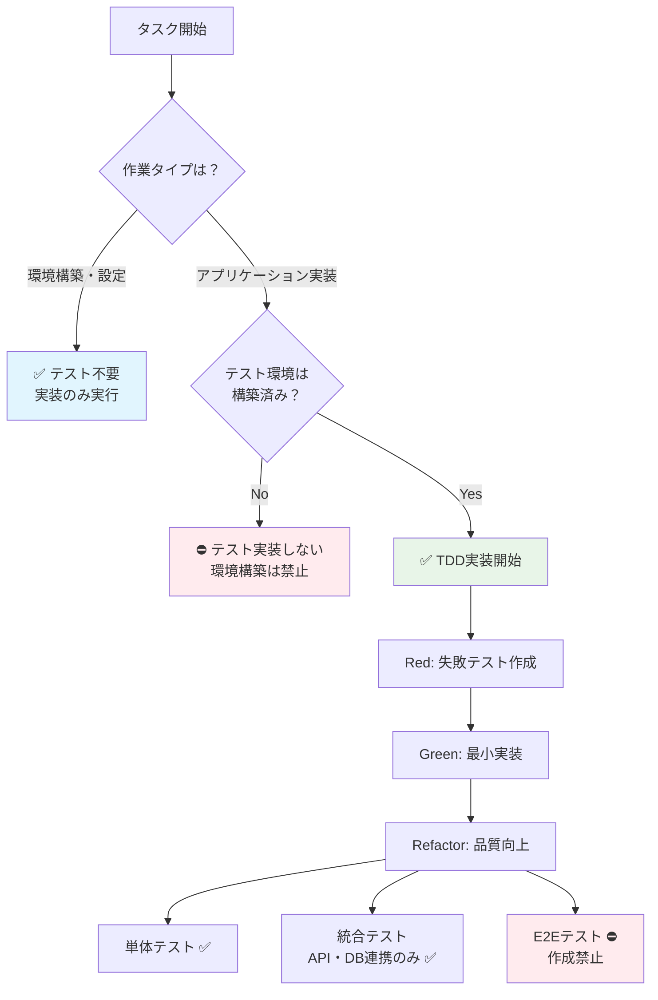

# TDD・テスト戦略

## テスト実装判定フローチャート

- YOU MUST: **以下のフローチャートに合わせてテストを実装するか否かを判断してください**



## テスト実装のクイックチェック

**開始前に必ず確認：**
1. ✅ これはアプリケーション実装？（環境構築ではない）
2. ✅ テスト環境は既に構築済み？
3. ✅ package.json や設定ファイルにテスト用の設定がある？

**すべて✅なら → TDD実装開始**

## 個人開発に最適化した3層テスト戦略

1. **単体テスト（TDD）**: 全機能で必須実行、TDDはt-wadaさんのやり方に準じて実装してください
2. **統合テスト**: API・DB連携部分のみ
3. **E2Eテスト**: 作成禁止 ⛔

## TDDサイクル（自動実行）

### Red → Green → Refactor

**Claude Codeの実行順序：**

1. **Red**: 失敗する単体テストを作成
2. **Green**: 最小限の実装でテスト通過
3. **Refactor**: コード品質向上（テスト結果は変更しない）

### 各段階のコミット例

```bash
# Red: 失敗テスト作成
git commit -m "test: add user login validation test (failing)"

# Green: 最小実装
git commit -m "feat: implement basic user login"

# Refactor: リファクタリング
git commit -m "refactor: extract validation logic"
```
