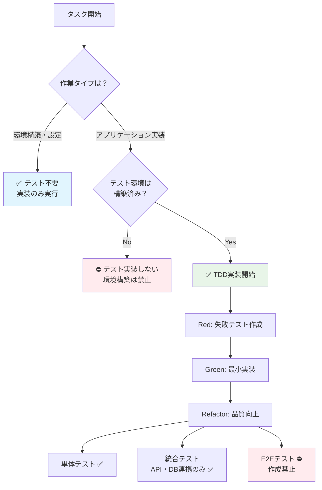

# テストガイドライン

## テスト実装判定フローチャート

- YOU MUST: **以下のフローチャートに合わせてテストを実装するか否かを判断してください**



## テスト実装のクイックチェック

**開始前に必ず確認：**
1. ✅ これはアプリケーション実装？（環境構築ではない）
2. ✅ テスト環境は既に構築済み？
3. ✅ package.json や設定ファイルにテスト用の設定がある？

**すべて✅なら → TDD実装開始**

## 1. TDD (Test-Driven Development)

### TDDの黄金サイクル（Red-Green-Refactor）

1. **Red（レッドフェーズ）**
   - まず失敗するテストを書く
   - 最小限の実装に対するテストとする
   - コンパイルエラーも失敗の一種
   - **重要**: 失敗を確認せずに次に進まない

2. **Green（グリーンフェーズ）**
   - テストを通すための最小限のコードを書く
   - ベタ書き、ハードコーディングもOK
   - とにかくテストを通すことだけに集中
   - **重要**: 必要以上の実装をしない

3. **Refactor（リファクタフェーズ）**
   - テストが通っている状態を維持しながらコードを改善
   - 重複を除去し、設計を改善
   - テストコード自体もリファクタリング対象
   - **重要**: 新しい機能は追加しない

### TDDの原則
- **テストファースト**: 実装前に必ずテストを書く
- **小さなステップ**: 1つのテスト = 1つの振る舞い
- **三角測量**: 2つ以上の具体例から一般化を導く
- **明白な実装**: 確信がある場合は最初から正しい実装を書いてもよい

### TDDのアンチパターン
- ❌ すべてのテストを先に書いてから実装を始める
- ❌ privateメソッドを直接テストする
- ❌ テストのためだけに実装を変更する
- ❌ モックを使いすぎる
- ❌ 実装の詳細に依存したテストを書く

## 2. テストファイルの構成

### 基本ルール
- **1クラス1テストファイル（厳守）**: `UserService`に対して`UserService.test.ts`のみ
- **テストファイルの分離禁止**: すべて同一テストファイル内に含める
- **describeブロックで階層化**: メソッドや機能単位で整理

### 構成例
```typescript
describe('UserService', () => {
    describe('listUsers', () => {
        test('ユーザーが存在する場合、リストを返す', async () => {
            // テストコード
        });
    });
    
    describe('createUser', () => {
        test('新規ユーザーの場合、作成される', async () => {
            // テストコード
        });
    });
});
```

### モック管理
- 全体共通のモック: ファイルレベルのbeforeEach/afterEachで管理
- 特定describe専用のモック: そのdescribeブロック内で管理

## 3. テスト記述スタイル

### AAA（Arrange-Act-Assert）パターン
```typescript
test('テストケース名', async () => {
    // Arrange - テストの準備・初期化
    const request = createRequest();
    
    // Act - 実行する操作
    const result = await service.execute(request);
    
    // Assert - 期待される結果の検証
    expect(result).toBe(expectedValue);
});
```

### コメントルール
- **許可されるコメント**: Arrange-Act-Assert、testの説明文のみ
- **禁止されるコメント**: 実装詳細、検証内容の説明、TODOなど
- **すべての説明はArrange-Act-Assertに集約**

### async/await関数のテスト
```typescript
// ✅ 良い例：async/awaitを使用
test('async関数のテスト', async () => {
    // テストコード
});

// ❌ 悪い例：Promiseを直接扱う
test('async関数のテスト', () => {
    return service.execute().then(result => {
        // テストコード
    });
});
```

## 4. テストの命名と文書化

### test関数の命名
- 「〜の場合、〜する」形式で前提条件と期待値を明確に記載
- 抽象的な表現（「正常に終了する」など）は避ける

### test.each（パラメータ化テスト）
```typescript
test.each([
    [true, '引数がtrueの場合、trueが返却される'],
    [false, '引数がfalseの場合、falseが返却される']
])('メソッドの動作確認: %s', (input, description) => {
    // テストコード
});
```

## 5. アサーション

### 基本ルール
- **expect().toBe()優先**: 値の一致確認は`expect().toBe()`を使用
- **内容も検証**: 件数だけでなく具体的な値も検証
- **登録・更新・削除ではリクエスト検証必須**: Vitestのモック機能でパラメータを確認

### 禁止アサーション
- `expect(true).toBe(true)`（常に成功するため無意味）
- `expect("test").toBe("test")`（リテラル比較は無意味）

## 6. テストパターン

### 検索系関数
- **必須ケース**: データあり、データ0件、エラー
- **統合すべきケース**: 同条件の複数データパターン
- **分離すべきケース**: エラー、特殊条件、境界値

### エラーハンドリング
- メソッド固有のエラー: 各メソッドでテスト
- 共通エラー: 専用describeブロックで網羅的にテスト
- 重複回避: 共通エラーを専用セクションでテスト済みなら個別メソッドでは省略可

### privateメソッド
- publicメソッド経由でテスト
- 複雑な共通処理は専用describeブロックで詳細テスト
- リフレクションは最終手段

## 7. テストの網羅性

### 必須要件
- すべてのpublicメソッドをテスト（静的メソッド含む）
- エラーハンドリングの網羅（メソッド固有のエラーはすべて）
- 分岐の網羅（if/switch文のすべての分岐）

## 8. テスト実行と検証

### 自動実行（ユーザーの指示不要）
1. **新規テストファイル作成時**
   - TypeScriptコンパイルチェック → テスト実行
   
2. **関数単位でのテスト実装時**
   - 1関数のテスト実装 → 即座にコンパイル・実行
   - エラーがあれば修正して再実行
   - PASSしたら次の関数へ

### 手動実行（ユーザー要求時のみ）
- 既存テストの軽微な修正では検証不要
- ロジック変更時はユーザーが明示的に要求

## 9. エラー解決の禁止事項

### テストコード削除禁止
- コンパイルエラーでもテストコードを削除しない
- エラーの根本原因を特定して修正
- テストのスキップ（test.skip）も禁止
- 空のテストへの置き換えも禁止

## 10. ベストプラクティス

### コード品質
- コメントは必要最小限（Arrange-Act-Assert以外は削除）
- UUID文字列は`crypto.randomUUID()`使用
- 未使用importは削除
- test.eachを積極活用
- 「〜が正常に生成される」→「〜が生成される」に簡潔化

### テスト最適化
```typescript
afterEach(() => {
    vi.clearAllMocks(); // 各テスト後にモッククリア
});
```

## 付録: TDD実践例

```typescript
// Step 1: Red - 失敗するテストを書く
test('1 + 1 = 2である', () => {
    const calculator = new Calculator();
    expect(calculator.add(1, 1)).toBe(2); // Calculatorもaddメソッドも存在しない
});

// Step 2: Green - 最小限の実装
class Calculator {
    add(a: number, b: number): number {
        return 2; // ベタ書きでOK
    }
}

// Step 3: Red - 次の失敗するテストを追加
test('2 + 3 = 5である', () => {
    const calculator = new Calculator();
    expect(calculator.add(2, 3)).toBe(5); // このテストは失敗する
});

// Step 4: Green - 一般化した実装
class Calculator {
    add(a: number, b: number): number {
        return a + b; // 三角測量により一般化
    }
}
```